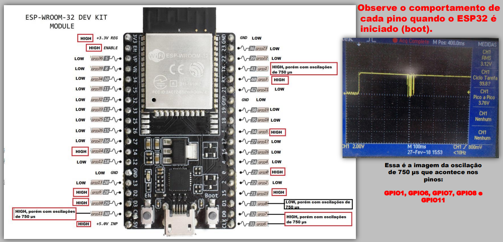

# INTRODUÇÃO AO ESP 32

## Instalação

1. Cole esse **link** https://raw.githubusercontent.com/espressif/arduino-esp32/gh-pages/package_esp32_index.json em:
      `Arquivo >> Preferências >> URL's adicionais para gerenciadores de placas`

      Isso acrescenta um local para a IDE buscar as dependências da placa Esp32.

2. Vá para: `Ferramentas >> Placa >> Gerenciador de placas >> Esp32` e clique em "Install". Isso instala as dependências específicas para essa placa.

3. Navegue até: `Ferramentas >> Placa >> Esp32 Arduino` e selecione "ESP32 DEV Module".

4. Navegue até: `Ferramentas >> Portas` e selecione a porta onde se estiver a ESP32 (normalmente é a opção que aparece).

Pronto, agora já deve ser possível trabalhar com sua ESP32.

> **Importante:** às vezes, ao fazer upload dos códigos para a placa, além de clicar no botão "Carregar" da IDE, é necessário pressionar o botão Boot da própira placa. Isso ficará evidente se nas mensagens não sair de "Connecting..."

## Pinos da Placa (GPIO)

### Funções do pinos

O microcontrolador possui diversos pinos e é por meio deles que são realizadas suas ações. Eles podem ser programados pelo usuário para assumir diversos papeis, como ser pino de saída digital, entrada digital, saída analógica (DAC), entrada analógica (ADC), touch capacitivo, além de servir a vários protocolos de comunicações padronizados como serial tx-rx, UART, I2C, I2S, dentre outros.

> **Importante**: em comparação com o Arduino UNO que usa tensões de 0V a 5V, a tecnologia do ESP32 utiliza tensões nos pinos que vão de 0V a 3,3V, ou seja é diferente! _Isso não deve ser nada amedrontador_, muitos sensores e circuitos estão preparados para essa diferença. Porém verifique a tecnologia dos sensores que pretende utilizar.

É **muito interessante**, (sério, recomendo de coração) que você pesquise sobre quais são as funções disponíveis nos pinos, pois isso estimula a critividade e sugere ideias daquilo que pode ser feito com o microcontrolador. Caso se sinta confortável em ler um material em inglês, tenho uma ótima sugestão no link abaixo (juro que é sucinto).

> *Observação*: Somente desconsidere a imagem presente na página com as posições dos pinos, pois ela é de outra placa esp32, com 36 pinos, enquanto a nossa é de 30. O nomes dos pinos e suas respectivas funções são as mesmas, pelo menos.

[Link para sugestão de página com descrição das funções](https://randomnerdtutorials.com/esp32-pinout-reference-gpios/)

### Pinagem física

O módulo ESP32-WRoom-32, quadrado metálico central que é produzido pela empresa chinesa *Expressif*, possui 38 pinos, incluindo aqueles de alimentação. Contudo, existem diferentes empresas que montam a placa do ESP32, e elas acabam fazendo isso de maneiras diferentes, mesmo que o coração delas (Esp32-WRoom-32) seja o mesmo. Por isso, há diversos formatos de esp32 no mercado e, mesmo que as funções dos pinos sejam as mesmas, é necessário verificar onde se encontram cada um desses pinos na placa.

Por exemplo, existe uma versão de placa, comum no mecado, com 36 pinos. Assim,ela deixa disponível quase tudo do chip para o usuário acessar. Porém, alguns desses pinos não tem muitas possibilidades de uso, e, aliás, podem impedir o funcionamento correto da placa se alterados indevidademente (pois já possuem funções padrão que são essenciais ao ESP32). Por isso, um outro encapsulamento existente da placa possui 30 pinos apenas, que podemos chamar de mais "seguro". Aliás, esse é o formato que os professores da disciplina decidiram utilizar, para uma experiência mais confortável dos alunos. 

A fim de auxiliar você na elaboração e execução do seu projeto, segue abaixo uma imagem com a legenda dos pinos. Vale ressaltar que em código deve-se sempre se referir ao pino pelo seu número de GPIO. Por exemplo, se quiser usar o "Touch9", você irá fazer uma leitura do touch do pino 32. 

Seria possível chamá-lo de "T9"? Sim, até é possível usar esse apelido do pino, mas não é sempre que isso funciona, por isso, repito, chame-o pelo GPIO que é mais seguro.

Fonte: [https://randomnerdtutorials.com/getting-started-with-esp32/](https://randomnerdtutorials.com/getting-started-with-esp32/)

## Boot

Fonte: https://www.fernandok.com/2018/03/esp32-detalhes-internos-e-pinagem.html