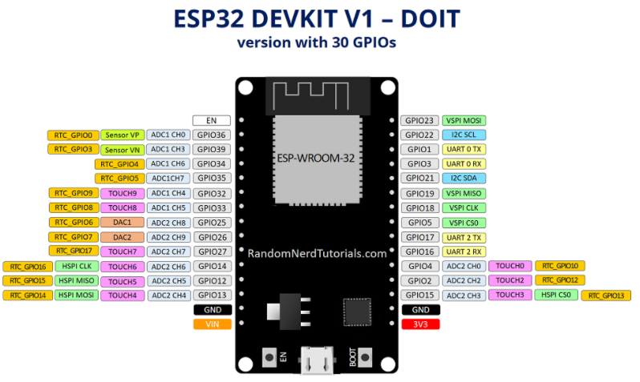

# INTRODUÇÃO AO ESP 32

## Instalação
1. Colar esse link https://raw.githubusercontent.com/espressif/arduino-esp32/gh-pages/package_esp32_index.json em :

``Arquivo >> Preferências >> URL's adicionais para gerenciadores de placas``

Isso acrescenta um local para a IDE buscar as dependências da placa Esp32.

2. Vá em `"Ferramentas >> Placa >> Gerenciador de placas >> Esp32"` e clique em "Install". Isso instala as dependências específicas para essa placa.

3. Navegue até `"Ferramentas >> Placa >> Esp32 Arduino"` e selecione "ESP32 DEV Module"

4. Navegue até `"Ferramentas >> Portas"` e selecione onde se encontrar a ESP32.

Pronto, agora já deve ser possível trabalhar com sua ESP32.

> Obs: às vezes, ao fazer upload dos códigos para a placa, além de clicar no botão "Carregar" da IDE, é necessário pressionar o botão Boot da própira placa. Isso ficará evidente se nas mensagens não sair de "Connecting..."

## Pinos da Placa

* Eis uma imagem com os pinos da placa:

Fonte: https://randomnerdtutorials.com/getting-started-with-esp32/

* Nesse link abaixo, há uam boa descrição das funções presentes nos pinos da placa. Somente desconsidere a imagem presente na página com as posições dos pinos, pois ela é de outra placa esp32, com 36 pinos, enquanto a nossa é de 30. O nomes dos pinos e suas respectivas funções são as mesmas, pelo menos.

Link: https://randomnerdtutorials.com/esp32-pinout-reference-gpios/

## Boot

Fonte: https://www.fernandok.com/2018/03/esp32-detalhes-internos-e-pinagem.html